# navalniy-model

3д версия "наклеек" кампании Алексея Анатольевича Навального.
=============================================================

How to do anything?
-------------------
Печатать белым пластиком. После печати нанести цветовую схему с помощью маркеров.  
Для защиты от влаги можно покрыть прозрачным лаком.  

How to modify?
--------------
Скрипты, генерирующие модели представлены в раздаче.   
Генерация моделей выполняется openscad-скриптами. Для построения моделей используется программа openscad.  
Документация по openscad общедоступна в сети.
Модели с надписями строятся на базе png карты высот, так что рендерятся долго...

Repository structure.
---------------------
Корневые скрипты моделей находятся в каталоге model.  
В каталоге src находится библиотека компонентов-"полуфабрикатов", вспомогательных функций и модулей.  
Каталог image содержит изображения, используемые для генерации рельефа.  
В корневом каталоге репозитория находятся готовые модели в формате stl.  

Feedback:   
Thingiverse:   

Images
------
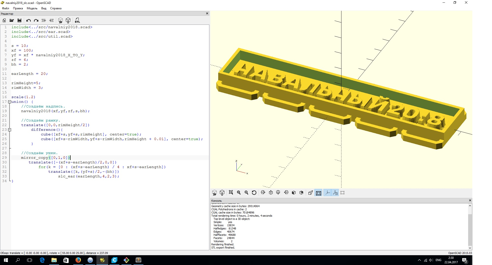
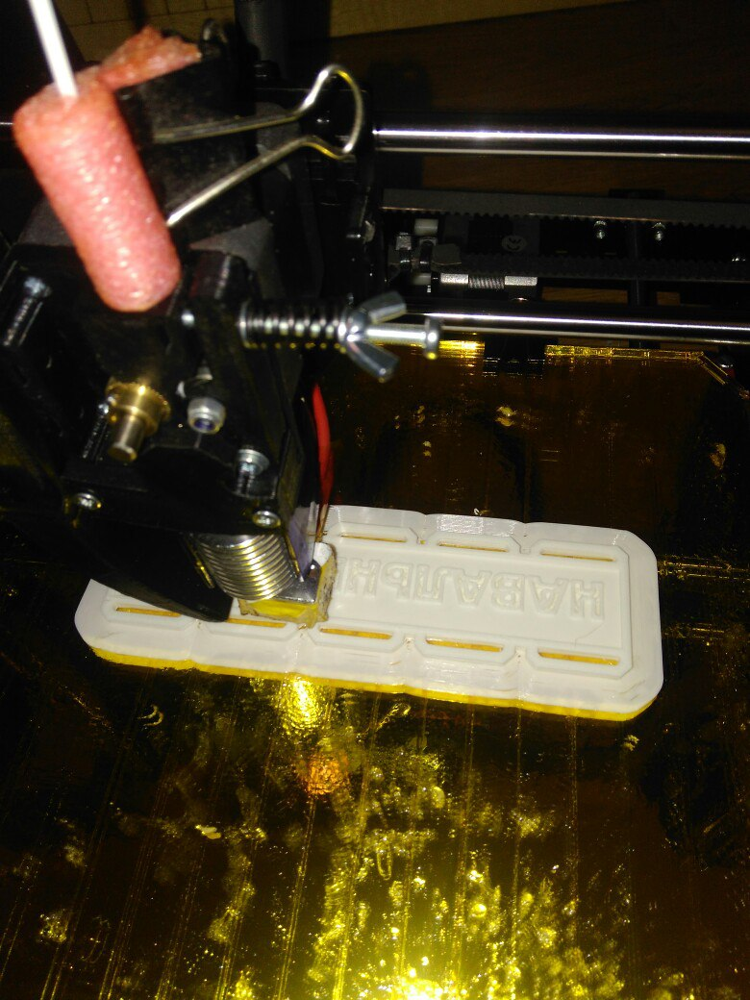
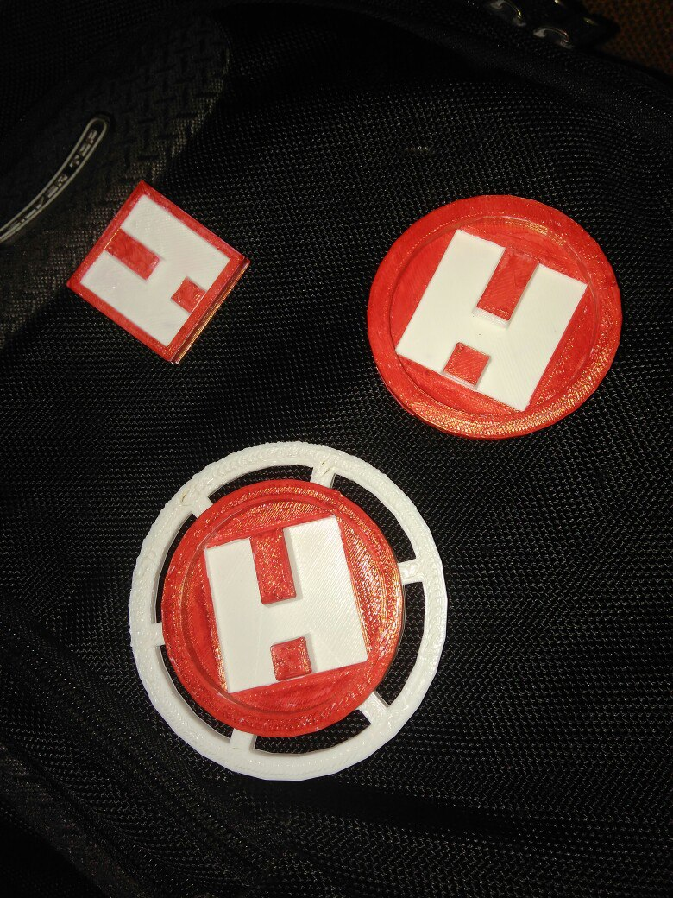
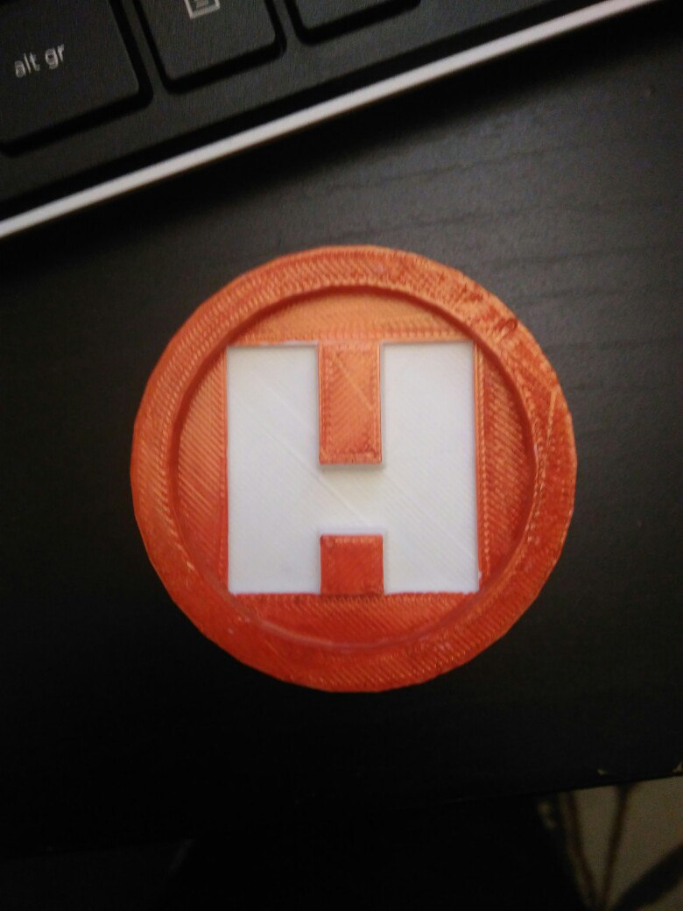
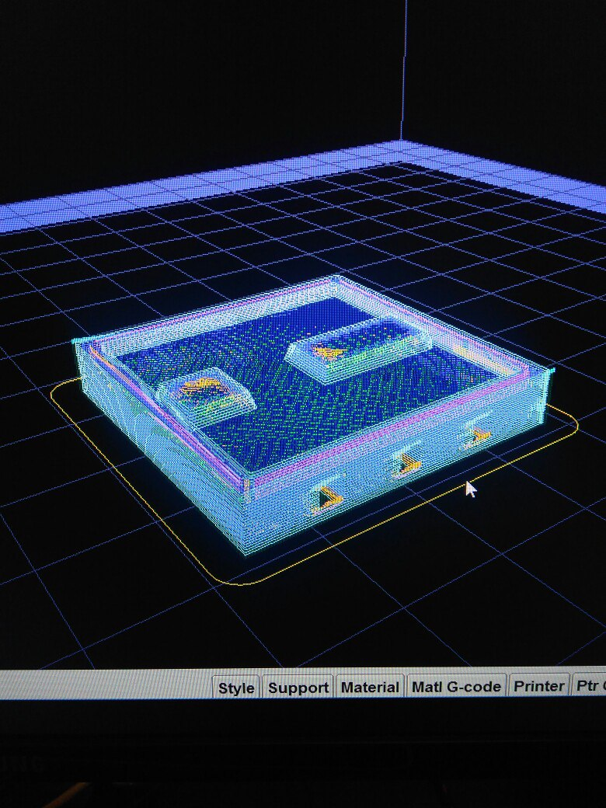
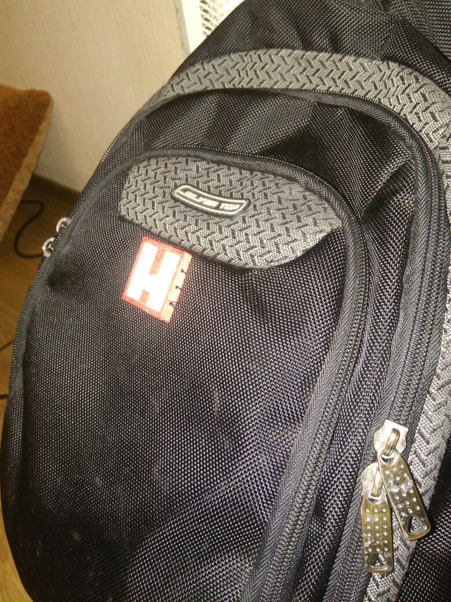
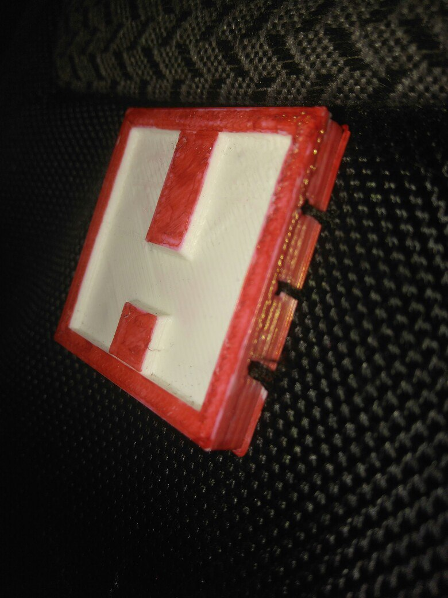
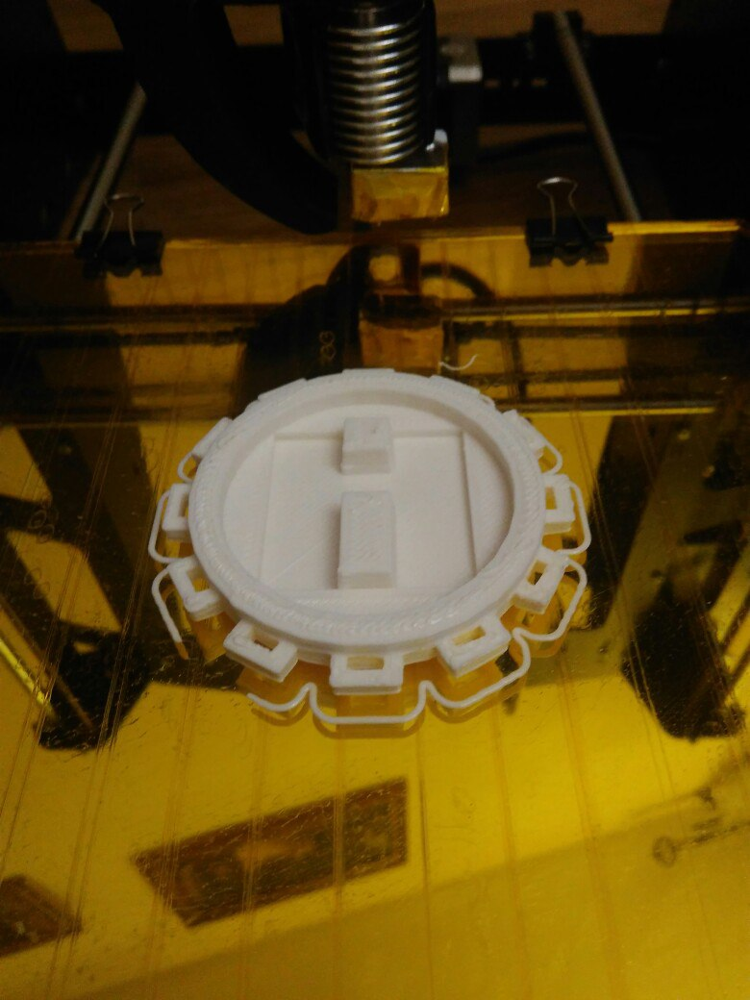
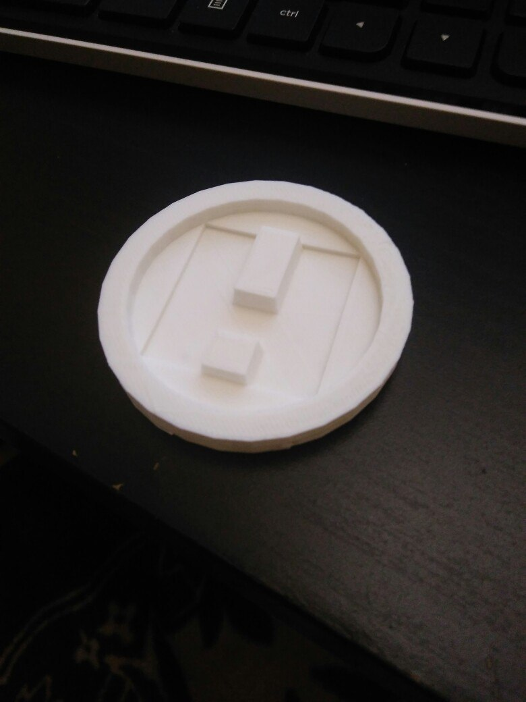
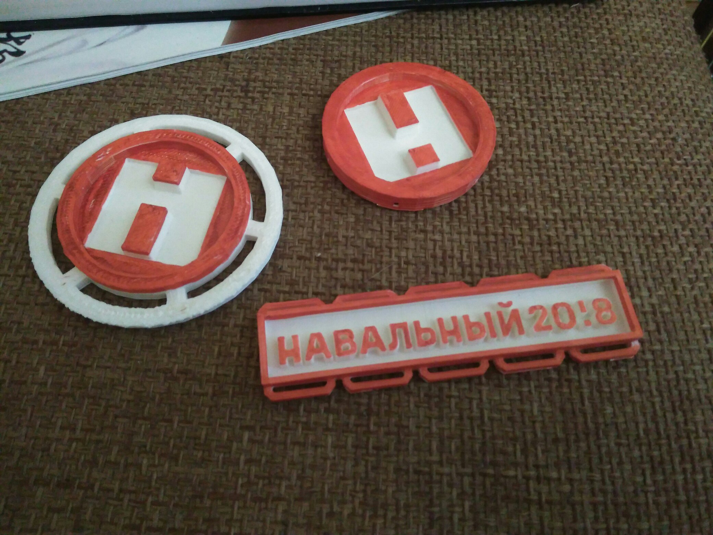
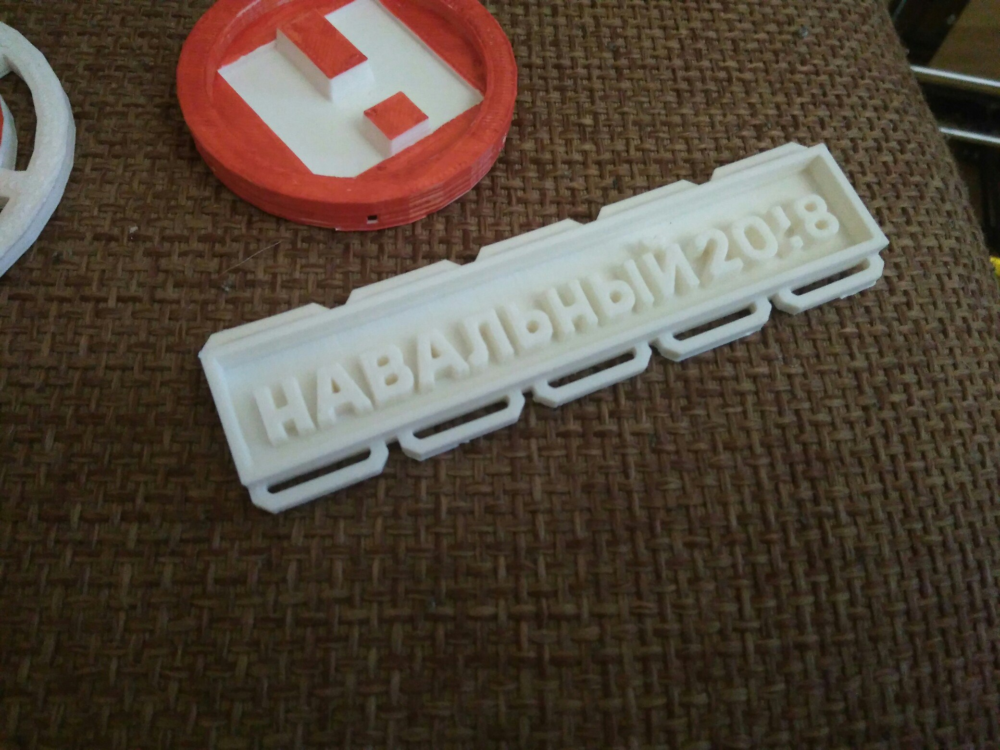
